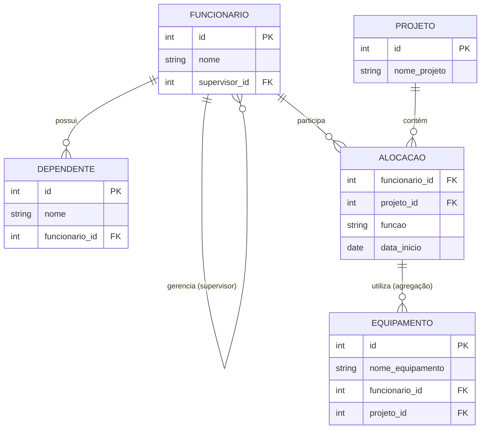

# Projeto BD — Agregação, Entidade Fraca e Autorelacionamento

Modelo relacional em PostgreSQL aplicando os conceitos de **autorelacionamento**,
**entidade fraca (dependência de existência)** e **agregação**, normalizado até a 3ª Forma Normal (3FN).

---

## Diagrama ER



---

## Autorelacionamento — Hierarquia de Supervisão

A tabela `funcionario` referencia ela mesma por meio da coluna `supervisor_id`.
Isso permite representar hierarquias de qualquer profundidade: um funcionário pode
ser supervisionado por outro funcionário da mesma tabela, e esse supervisor pode
ter o seu próprio supervisor, e assim por diante.

A coluna é `nullable` (`ON DELETE SET NULL`), pois o funcionário no topo da
hierarquia não possui supervisor.

```sql
supervisor_id INTEGER REFERENCES funcionario(id) ON DELETE SET NULL
```

---

## Agregação — Equipamentos vinculados a uma Alocação

O problema central era: *como registrar que um equipamento é usado por um
funcionário em um projeto específico, sem violar a 3FN?*

A solução ingênua seria colocar `funcionario_id` e `projeto_id` diretamente em
`equipamento` como FKs independentes. Isso cria uma dependência transitiva:
o equipamento depende do **par** funcionário+projeto, não de cada um isoladamente
— violando a 3FN.

A solução correta é a **agregação**: o relacionamento entre `FUNCIONARIO` e
`PROJETO` é materializado como a entidade `ALOCACAO`, com chave primária composta
`(funcionario_id, projeto_id)`. A tabela `equipamento` então referencia esse par
via FK composta, declarando formalmente a dependência:

```sql
CONSTRAINT fk_equipamento_alocacao
    FOREIGN KEY (funcionario_id, projeto_id)
    REFERENCES alocacao(funcionario_id, projeto_id)
    ON DELETE CASCADE
```

Assim, cada equipamento pertence a uma alocação — e não a um funcionário ou
projeto isolado — mantendo o modelo na 3FN.

---

## Como executar

```bash
psql -U postgres -d seu_banco -f schema.sql
```

---

## Tecnologias

- PostgreSQL 15+
- Mermaid (diagrama ER renderizado nativamente pelo GitHub)
