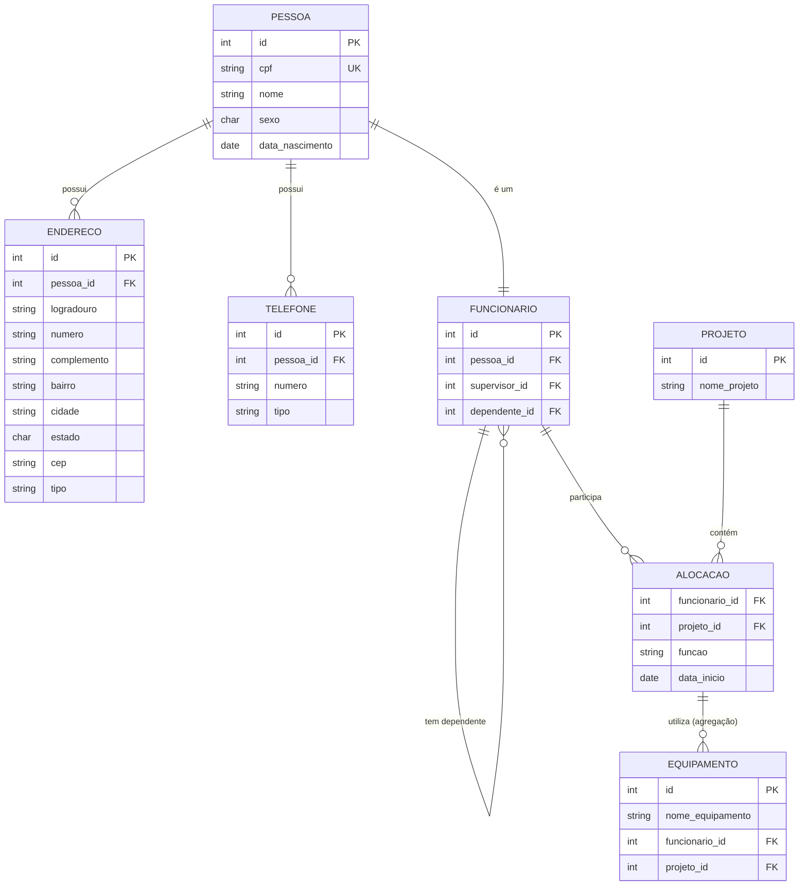

# Projeto BD — Agregação, Entidade Fraca e Autorelacionamento

Modelo relacional em PostgreSQL aplicando os conceitos de **autorelacionamento**,
**entidade fraca (dependência de existência)** e **agregação**, normalizado até a 3ª Forma Normal (3FN).

---

## Diagrama ER



---

## Decisão de modelagem — Tabela Pessoa como base

A tabela `pessoa` centraliza os dados comuns a qualquer indivíduo no sistema
(cpf, nome, sexo, data de nascimento). `funcionario` herda de `pessoa` via
`pessoa_id FK UNIQUE`, evitando repetição de atributos — o que mantém a 3FN:
nenhum dado pessoal fica duplicado em outra tabela.

---

## Endereço subatômico

O endereço foi decomposto em colunas atômicas (`logradouro`, `numero`,
`complemento`, `bairro`, `cidade`, `estado`, `cep`) em uma tabela separada,
pois uma pessoa pode ter vários endereços. Isso satisfaz a 1FN (sem grupos
repetitivos) e evita dependências transitivas que violariam a 3FN.

---

## Telefone

Separado em tabela própria pelo mesmo motivo: uma pessoa pode ter múltiplos
telefones. O campo `tipo` controla se é `celular`, `residencial` ou `comercial`.

---

## Autorelacionamento 1 — Hierarquia de Supervisão

A tabela `funcionario` referencia ela mesma por meio de `supervisor_id`.
Permite hierarquias de qualquer profundidade. A coluna é `nullable`
(`ON DELETE SET NULL`), pois o funcionário no topo não possui supervisor.

```sql
supervisor_id INTEGER REFERENCES funcionario(id) ON DELETE SET NULL
```

---

## Autorelacionamento 2 — Dependente

Um funcionário pode ser dependente de outro funcionário dentro da mesma tabela,
por meio de `dependente_id`. O mesmo comportamento `ON DELETE SET NULL` garante
que a remoção de um funcionário não apaga o dependente — apenas desfaz o vínculo.

```sql
dependente_id INTEGER REFERENCES funcionario(id) ON DELETE SET NULL
```

---

## Agregação — Equipamentos vinculados a uma Alocação

O relacionamento entre `FUNCIONARIO` e `PROJETO` é materializado como a entidade
`ALOCACAO`, com chave primária composta `(funcionario_id, projeto_id)`.

A tabela `equipamento` referencia esse par via FK composta, declarando formalmente
que o equipamento pertence à alocação — não a um funcionário ou projeto isolado:

```sql
CONSTRAINT fk_equipamento_alocacao
    FOREIGN KEY (funcionario_id, projeto_id)
    REFERENCES alocacao(funcionario_id, projeto_id)
    ON DELETE CASCADE
```

Isso mantém o modelo na 3FN: `nome_equipamento` depende exclusivamente de `id`,
sem dependências transitivas.

---

## Decisão de modelagem — CPF como UNIQUE, não como PK

O CPF está em `pessoa` como `VARCHAR(14) NOT NULL UNIQUE`.
A chave primária técnica continua sendo `id SERIAL`, pelos seguintes motivos:

- **Performance**: FKs com `INTEGER` são mais leves que `VARCHAR(14)` em joins e índices.
- **Estabilidade**: CPF pode precisar de correção cadastral — uma PK string que muda quebra todas as FKs em cascata.
- **Boas práticas**: separar identidade de negócio (CPF) da identidade técnica (id) é o padrão adotado pela indústria.

---

## Como executar

```bash
psql -U postgres -d seu_banco -f schema.sql
```

---

## Tecnologias

- PostgreSQL 15+
- Mermaid (diagrama ER renderizado nativamente pelo GitHub)
