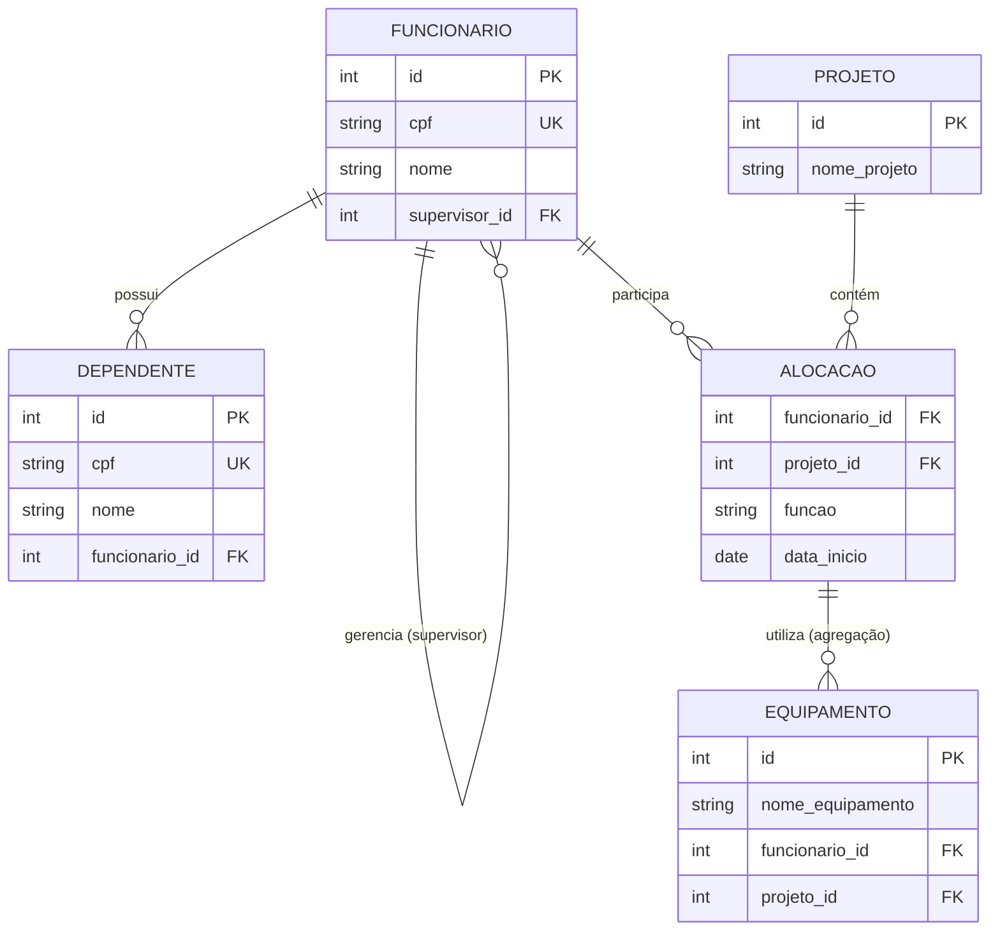

# Projeto BD — Agregação, Entidade Fraca e Autorelacionamento

Modelo relacional em PostgreSQL aplicando os conceitos de **autorelacionamento**,
**entidade fraca (dependência de existência)** e **agregação**, normalizado até a 3ª Forma Normal (3FN).

---

## Diagrama ER



---

## Decisão de modelagem — CPF como UNIQUE, não como PK

O CPF está presente em `funcionario` e `dependente` como `VARCHAR(14) NOT NULL UNIQUE`.
A chave primária técnica continua sendo `id SERIAL`, pelos seguintes motivos:

- **Performance**: FKs com `INTEGER` são mais leves que `VARCHAR(14)` em joins e índices.
- **Estabilidade**: CPF é dado sensível e pode precisar de correção cadastral. Uma PK string que muda quebra todas as FKs em cascata.
- **Boas práticas**: separar identidade de negócio (CPF) da identidade técnica (id) é o padrão adotado pela indústria.

O `UNIQUE` garante que dois funcionários não podem ter o mesmo CPF — a regra de negócio está preservada sem os custos de uma PK string.

---

## Autorelacionamento — Hierarquia de Supervisão

A tabela `funcionario` referencia ela mesma por meio da coluna `supervisor_id`.
Isso permite representar hierarquias de qualquer profundidade: um funcionário pode
ser supervisionado por outro funcionário da mesma tabela.

A coluna é `nullable` (`ON DELETE SET NULL`), pois o funcionário no topo da
hierarquia não possui supervisor.

```sql
supervisor_id INTEGER REFERENCES funcionario(id) ON DELETE SET NULL
```

---

## Agregação — Equipamentos vinculados a uma Alocação

O relacionamento entre `FUNCIONARIO` e `PROJETO` é materializado como a entidade
`ALOCACAO`, com chave primária composta `(funcionario_id, projeto_id)`.

A tabela `equipamento` referencia esse par via FK composta, declarando formalmente
que o equipamento pertence à alocação — não a um funcionário ou projeto isolado:

```sql
CONSTRAINT fk_equipamento_alocacao
    FOREIGN KEY (funcionario_id, projeto_id)
    REFERENCES alocacao(funcionario_id, projeto_id)
    ON DELETE CASCADE
```

Isso mantém o modelo na 3FN: `nome_equipamento` depende exclusivamente de `id`,
e as FKs apontam para a entidade correta sem criar dependências transitivas.

---

## Como executar

```bash
psql -U postgres -d seu_banco -f schema.sql
```

---

## Tecnologias

- PostgreSQL 15+
- Mermaid (diagrama ER renderizado nativamente pelo GitHub)
